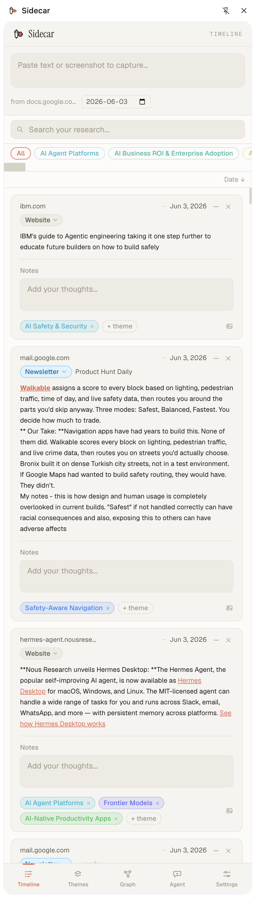
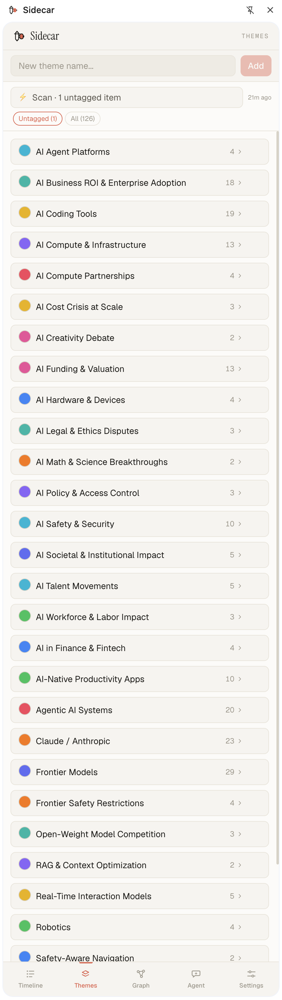

# Sidecar

A Chrome extension that lives in your browser's side panel and acts as a persistent research workspace. As you browse newsletters, Reddit, Twitter, or any web page, you can capture quotes and content, annotate them with personal notes, track their source and date, and search across everything you've saved.

Beyond capture, Sidecar turns what you've collected into **compounding research**: it surfaces cross-theme insights, then a Claude-powered builder researches an insight in depth and writes a structured **knowledge wiki** (open markdown, OKF format) you can ask questions against and spin into newsletter or blog drafts.

Built as a local-first tool — all data stays in your browser (IndexedDB), with export options for backup and portability. The generated wiki is plain markdown written to a folder you choose (point it at an Obsidian vault if you like).

The extension wears a warm-neutral identity: Instrument Serif for the wordmark and headings, Geist for the body, Geist Mono for the chrome (eyebrows, source tags, keyboard hints). The toolbar icon is a top-down motorcycle outline with a coral sidecar pod — the same mark sits in the panel header next to the wordmark. Day and night modes use the same coral accent over warm-neutral surfaces.

---

## Screenshots

| Timeline | Themes |
|---|---|
|  |  |

> _A Research-tab screenshot will be added once the new flow is captured._

---

## What it does now

### Capture
- Paste text into the capture bar at the top of the panel to save it instantly
- The current tab's URL and today's date are auto-filled on every capture
- Drag-and-drop or paste images (screenshots) directly into the capture bar — they're stored as attachments on the item
- Add a screenshot to any existing item using the 📎 button on its card
- Press `⌘↵` (or `Ctrl↵`) to capture, `Esc` to clear

### Source tagging
- Every item is automatically tagged with one of six source types: **Newsletter**, **Website**, **Twitter/X**, **Reddit**, **Product**, or **Internal**
  - Pages on `mail.google.com` are tagged Newsletter and attempt to extract the sender name from the open email
  - `twitter.com` / `x.com` pages are tagged Twitter; `reddit.com` pages are tagged Reddit
  - Other public pages are tagged Website by default
  - **Product** and **Internal** are user-assigned — use Product for tool/landing-page captures, Internal for personal notes or company events
- Click the source tag on any item to change it via a dropdown, and edit the sender/label field alongside it

### Timeline
- All captured items appear in reverse-chronological order by default
- Toggle to oldest-first with the sort button at the top of the timeline
- Search across all item content, notes, URLs, and page titles using the search bar (fuzzy search powered by Fuse.js)
- Filter by theme via the chip strip above the list — single-select, intersects with search
- Result count shown when a search or filter is active; clear it to return to the full timeline

### Themes & organization
- Create named, color-coded theme buckets from the Themes tab — 10-color palette, recolorable any time
- Inline rename, color-swatch picker, and delete (cascades — also drops from all tagged items)
- Click the **+ theme** chip on any item to assign an existing theme, or type a new name + `Enter` to create + assign in one step
- Expand any theme on the Themes tab (click its item count) to see all items tagged with it as full cards, newest first
- Each item card shows its assigned theme chips; click the `×` on a chip to unassign

### AI auto-categorize
- One-click **Scan** from the Themes tab sends your corpus to Claude (default: Sonnet 4.6; optional: Haiku 4.5)
- **Scope toggle** below the button — `Untagged (N)` (items with no themes assigned, the default once any exist) or `All (N)` (everything, useful when you want fresh proposals from already-tagged content)
- Cost-confirm popover before sending shows the item count and a rough input-token estimate
- Returns two things in one structured call (Anthropic tool-use): **tag suggestions** to existing themes (with confidence) and **proposals** for new themes (with supporting items)
- Inline **review queue** on the Themes tab — nothing auto-applies:
  - Proposals: editable name + recolorable swatch before approve; approve creates the theme and tags its supporting items in one go
  - Tag suggestions: grouped by theme with per-row ✓/✗ and bulk ✓ all / ✗ all per group
- **Rejection memory** — rejected proposals and assignments are remembered and excluded from the next scan; self-heals if you later manually create/assign the same thing

### Per-item editing
- **URL** — click to edit inline; domain and favicon shown in display mode
- **Date** — click to edit with a date picker; timeline re-sorts automatically when a date is changed
- **Notes** — free-text textarea below each item's content; saves on blur
- **Markdown rendering** — captured content is rendered as formatted markdown (GFM supported)
- **Delete** — remove an item and all its attachments with the ✕ button

### Appearance
- Dark mode, light mode, and system (follows OS setting) — toggled from Settings
- Preference is persisted across sessions

### Backup & restore
- **Connect a backup folder** (File System Access API) — point Sidecar at any folder on disk. It serves two roles:
  - auto-writes a `sidecar-snapshot.json` (your restorable corpus) on every change (debounced ~2s), and
  - hosts the **OKF knowledge bundle** the Research builder writes (`sources/`, `insights/`, `themes/`, `outputs/`, `notes/`, plus `index.md` + `log.md`). The two write paths are independent — chatting/building never re-serializes the corpus snapshot.
- Point the folder at iCloud Drive / Dropbox / Google Drive (or an **Obsidian vault**) for free cross-device sync, version history, and a browsable wiki
- **Restore from folder** loads the snapshot back, replacing local data
- **Import JSON** picks a backup file directly — shows a summary modal of what's inside before replacing data
- **Export JSON** is a full corpus backup including attachments, settings, suggestions, and rejections (base64-encoded blobs round-trip through import). The API key is **never** included; local/derived tables (builds, source cache, vault index) are excluded too.
- **Export Markdown** — one entry per item, Obsidian-compatible YAML frontmatter
- Storage status line shows whether the browser has marked IndexedDB as persistent (requested automatically on first launch)

### AI research builder & compounding wiki
The **Research** tab turns an insight into durable, compounding research rather than a throwaway chat answer. It writes everything as an **OKF knowledge bundle** — a directory of markdown files with YAML frontmatter ([Open Knowledge Format](https://github.com/google/open-knowledge-format)) — into your connected backup folder, *alongside* the JSON snapshot. Point that folder at an Obsidian vault and you can browse, link, and graph the same files there; Sidecar is the writer, the vault is the readable artifact.

The tab has four modes:

- **Insights → dossier → output.** Pick an insight and click **Build research**. Sidecar gathers the insight's themes and items, **resolves each source** (source-aware: newsletters use your pasted snippet as the seed; articles are fetched + extracted; Reddit via its thread JSON; Twitter/X falls back to the snippet), optionally deepens via Claude's **web search**, and synthesizes a structured **dossier** (`insights/<slug>.md`) with thesis / evidence / findings / contradictions / citations. Progress and estimated cost show live; builds are checkpointed so a closed panel doesn't lose work. From a dossier you can **Generate** a **Newsletter** or **Blog post** — or set the output model to **Manual** and hand the dossier off to any tool. Dossiers and outputs persist (reloaded from the vault) and export as `.md`.
- **Themes (theme pages).** Each theme gets a rolling synthesis page (`themes/<slug>.md`) — the cheap, always-current counterpart to the deep dossier. Refreshing a page **integrates only what changed** since the last build (preserving prior synthesis and flagging contradictions) rather than regenerating from scratch. Freshness dots show **not built / fresh / stale**; a batch **Refresh all stale** rebuilds everything that drifted.
- **Ask (wiki-grounded Q&A).** Ask a question and the agent reads the bundle's `index.md`, drills into the relevant concepts (progressive disclosure), and answers **grounded only in your wiki**, with bundle-relative citations — not generic model knowledge. Good answers **Save to wiki** as `notes/*.md` so explorations compound too. The chat itself is ephemeral; durability comes from filing answers back.
- **Health (lint).** A structural health check finds **stale** and **missing** theme pages, **stale dossiers**, and **orphaned sources** (whose item was deleted), each with a one-click fix.

**Freshness** is derived, not flagged: each built page records a hash of the evidence it was built from (item ids + last-modified), and staleness is a live comparison against the current corpus — so badges update reactively as you capture and tag.

**Retrieval design note.** The builder resolves and reads the actual sources rather than doing lexical retrieval; the Ask agent navigates by the OKF `index.md` + `read_concept` drill-down instead of embeddings. **Revisit if** a bundle grows large enough that index-driven navigation misses relevant pages — at that point a real embeddings provider (Voyage, local MiniLM via `transformers.js`, or whatever Anthropic ships) can slot in behind the same `read_concept` step. See `docs/PHASE5.md` for the full design.

### Knowledge graph
- An interactive node-link diagram lives in the **Graph** tab. Two tiers of nodes: **items** (raw captures, neutral) and **themes** (your buckets, in their assigned color). The third tier — **insights** — doesn't render as a node; insights appear as **ambient translucent blobs** wrapping the themes + items they're grounded in, each in a different colour from a cycling palette so they're distinguishable.
- **Insight surfacing** — the **Surface insights** button (under the Graph tab) sends your themes, their item samples, and the theme-overlap matrix to Claude with a tool-use call. The model returns short claims like _"Rise of robotics-startup chatter"_ — each grounded in 2+ themes and the supporting items.
- **Insights are reviewable** — proposals show headline, rationale, the contributing theme chips, supporting items, and a strength score. Approve to materialize as a blob in the graph; reject to teach the next pass not to re-propose it.
- **Ambient blobs** — every approved insight renders as a faded blob at all times with the headline pill floating at its centroid. Selecting one (by clicking inside the blob or picking it from the list) saturates that blob and **fades every non-supporting node and link**, the same way selecting a node does.
- **Sidebar lives on insights** — the right rail (pop-out) and the right pane below the canvas (in-panel) are anchored on the **Insights list**. Selecting an insight expands its detail above the list — list stays visible so you can jump between insights without closing detail.
- **Drill navigation with Back** — every detail panel supports drill-through:
  - Click a **theme** node → sidebar shows the theme's full item list.
  - Click any item snippet (in a theme list, in an insight's grounding items, etc.) → sidebar drills to the item's full markdown content.
  - A **Back** chevron at the top pops to the previous selection — theme → item → back to theme list, or insight → item → back to insight.
- **Pop-out tab + auto-handoff** — click **Pop out** to open the graph in a full Chrome tab. The side panel detects via `BroadcastChannel` heartbeat that the pop-out is alive and replaces its canvas with a "view graph in pop-out" placeholder; close the tab and the side-panel canvas returns. Insights list + surfacing + review queue stay live in both places.
- **Derived edges** — item↔theme links come from `themeIds`; theme↔theme co-occurrence is computed in-memory (min weight 2). Insights track their evidence via `insight.themeIds` + `insight.itemIds` — that's what shapes the blob.
- **Filters, search, multi-select** — type-filter chips toggle Items / Themes / Insights independently (turning off Insights hides all blobs). Highlight search fades non-matching nodes. ⌘/Ctrl/Shift-click on theme/item nodes enters compare mode with set ops (union / intersection / exclusive / only-in-X) over their item sets.

### Settings
- Store your Anthropic API key — held in `chrome.storage.local` (not IndexedDB), so it is **never** written into the backup snapshot or vault. A **Show/Hide** toggle and **Clear** button let you verify exactly what's saved.
- Pick the scan model — Sonnet 4.6 (default) or Haiku 4.5 (cheaper, rougher proposals)
- Pick the insight surfacing model — Sonnet 4.6 (default) or Haiku 4.5
- Pick the **output model** for generated newsletters/blogs — any Claude model, or **Manual** (no generation; you hand the dossier off elsewhere)
- Set a **writing voice** — a reusable style/audience/length prompt injected into output generation so drafts sound like you
- Clear all data from the danger zone

---

## How to use it

A happy-path walkthrough from first install to a fully-connected knowledge graph. Most steps build on the previous one — the order matters.

### 1. First-run setup
1. Build the extension (`npm install && npm run build`) and load `dist/` as an unpacked extension at `chrome://extensions` with **Developer mode** on.
2. Click the Sidecar icon in the toolbar — the side panel opens.
3. Go to the **Settings** tab and paste your Anthropic API key (use **Show** to confirm it). Pick a scan model, insight surfacing model, and output model (defaults are fine); optionally set a writing voice.
4. *Recommended (required for the Research builder):* click **Connect backup folder** in Settings and point at a synced folder or an **Obsidian vault**. This stores the corpus snapshot **and** the OKF wiki the builder writes. Auto-snapshots start immediately.

### 2. Capture some items
1. With the side panel open, browse to any newsletter, article, tweet, or page you want to remember.
2. Select text on the page, copy it, then paste into the capture bar at the top of the **Timeline** tab. Hit `⌘↵` (or `Ctrl↵`) to save.
3. The URL, domain, and today's date are auto-filled. Source type is auto-detected (Newsletter / Twitter / Reddit / Website).
4. Add 10–20 items across different topics to make the next steps interesting.

### 3. Organize into themes
1. Go to the **Themes** tab. Either:
   - Create a few themes manually (click **+ new theme**, name it, pick a color), or
   - Click **Scan** at the top of the Themes tab. Claude reads your corpus and proposes both new themes and item-to-theme assignments.
2. In the **Review** queue that appears, approve / reject each proposal and assignment. Rejected items are remembered — they won't come back in the next scan.
3. On the timeline, click **+ theme** on any item to manually assign one too.

### 4. Surface insights
1. Go to the **Graph** tab. At the top you'll see the **Surface insights** button. It's only enabled once you have themes — insights are *patterns across themes*, so themes are a prerequisite.
2. Click it. The cost-confirm popover shows how many themes + items are about to be sent, plus a token estimate. Click **Surface** to send.
3. An **Insights to review** queue appears. Each proposal carries:
   - **Headline** — a short claim (e.g. "Rise of robotics-startup chatter"). Click to rename.
   - **Rationale** — 1–2 sentences explaining the pattern.
   - **Theme chips** — the themes whose interplay surfaces this insight.
   - **Grounding items** — expand to see the captures the model is leaning on.
   - **Strength** — strong / medium / weak.
4. Approve to materialize the insight as a node; reject to teach the next pass not to re-propose it.
5. If no insights come back, the panel will say so explicitly — usually means your corpus is still single-theme heavy.

### 5. Explore the graph
1. Below the review queue, the graph canvas renders. Items and themes appear as nodes; **insights appear as ambient translucent blobs** wrapping the themes + items each one is grounded in, with the headline floating at the centroid.
2. Use the type-filter chips (Items / Themes / Insights) to focus. Turning off **Insights** hides every blob; turning it back on restores them.
3. Type in the **Highlight** box to fade non-matching nodes.
4. **Find an insight** in one of two ways:
   - Click anywhere inside a blob on the canvas — it saturates, every non-supporting node fades back, and the **Insights list** in the sidebar scrolls to that insight with its detail expanded above.
   - Pick it directly from the **Insights list** in the sidebar.
5. **Drill into themes and items**:
   - Click a theme node → sidebar shows every item tagged with that theme.
   - Click any item snippet (in a theme list, in an insight's grounding items, anywhere) → sidebar drills to the item's full markdown content.
   - The **Back** chevron at the top of the detail panel pops one step — theme list → item → back to theme list, or insight → item → back to insight.
6. **⌘/Ctrl/Shift-click** two or more theme/item nodes to enter compare mode — a Compare panel takes over the sidebar with set-ops (Union / Intersection / Exclusive / Only-in-X) over the selected nodes' item sets.
7. For a roomier view, click **Pop out** in the Graph tab header to open the graph in a full Chrome tab. The side panel notices and replaces its canvas with a "view graph in pop-out" placeholder while the pop-out is open — close that tab and the side-panel canvas comes back. Insights list + Surface insights + review queue stay usable in both windows simultaneously.

### 6. Build research, outputs, and Q&A
1. Go to the **Research** tab (needs a connected vault folder + API key). It has four modes: **Insights · Themes · Ask · Health**.
2. **Insights** — pick an insight and click **Build research**. Watch it resolve sources → research → write the dossier (step + cost show live). When it lands, read the dossier inline, then pick **Newsletter** or **Blog post** and **Generate** — or set the output model to **Manual** in Settings and use **Copy/Export** to finish the dossier elsewhere.
3. **Themes** — build a theme's wiki page; capture/tag a new item into that theme and its dot turns **stale** — hit **Refresh** and it integrates just the new material. Use **Refresh all stale** to catch up everything at once.
4. **Ask** — ask a question; the answer is grounded in your built wiki with citations. **Save to wiki** anything worth keeping.
5. **Health** — run the check to find missing/stale pages and orphaned sources, and fix them in one click.
6. Open the folder (or your Obsidian vault) to see the bundle: `sources/`, `insights/`, `themes/`, `outputs/`, `notes/`, with `index.md` + `log.md`.

### 7. Iterate
1. Capture more items as you browse. Items added since the last scan show up in the **Untagged** scope so re-running Scan only touches the new stuff.
2. Re-run **Surface insights** whenever your theme structure shifts meaningfully — insights age, and the model will catch new threads once you've added new items / themes.
3. Open the graph periodically — new items wire themselves into the existing structure via their themes, and existing insights' blobs grow to include any newly-tagged grounding items.
4. If a backup folder is connected, every change auto-saves; you can move between machines by pointing a new install at the same folder and clicking **Restore from folder** in Settings.

---

## Coming soon

### User-asserted edges (v2.0)
The graph's structural edges are derived in-memory today — item↔theme membership plus theme↔theme co-occurrence. Insights track their own evidence (`themeIds` + `itemIds`) and drive the blob shape. v2.0 will add **manual edges**: a "this relates to that" gesture on any two nodes that materializes to the existing `edges` table, persists across sessions, and shows up alongside the derived ones. Useful for asserting connections the model didn't catch (e.g. "this paper is the response to that paper"). The schema is already in place; only the UI and persistence are deferred.

---

## Tech stack

| Concern | Choice |
|---|---|
| Extension | Chrome Manifest V3 + Side Panel API |
| Build | Vite + `@crxjs/vite-plugin` + TypeScript |
| UI | React 18 + Tailwind CSS, Geist + Instrument Serif + Geist Mono via Google Fonts, line-icon set in `components/Icons.tsx` |
| Storage | Dexie.js (IndexedDB) for the corpus; `chrome.storage.local` for the API key |
| Search | Fuse.js (timeline search) |
| Markdown | react-markdown + remark-gfm |
| AI | Anthropic SDK (claude-opus-4-8 / claude-sonnet-4-6 / claude-haiku-4-5), tool-use for structured output, server-side `web_search` in the builder, per-role model bindings, lazy-loaded |
| Knowledge format | OKF markdown bundle (frontmatter + `index.md`/`log.md`) written via the File System Access API |
| Backup | File System Access API (corpus snapshot + OKF vault to a user-chosen folder) + persisted IndexedDB |
| Graph | react-force-graph-2d (in-panel canvas + pop-out full-page tab) |
| Export | file-saver |

---

## Development

**Prerequisites:** Node.js, Chrome

```bash
npm install
npm run dev        # starts Vite dev server with hot reload
npm run build      # produces a production build in dist/
```

**Load the extension in Chrome:**
1. Go to `chrome://extensions`
2. Enable **Developer mode**
3. Click **Load unpacked** and select the `dist/` folder
4. Click the Sidecar icon in the toolbar to open the side panel

After reloading the extension, refresh any open tabs to reinitialise the content scripts.

---

## Data & privacy

Everything is stored locally in your browser's IndexedDB. Nothing is sent anywhere unless you enter an Anthropic API key and then run one of the AI actions:
- **Scan** / **Surface insights** send item snippets + notes (and theme overlaps) to the Anthropic API.
- **Build research** sends the insight's resolved source text and may **fetch the source URLs directly** (articles, Reddit JSON) and use Claude's **web search** to deepen the dossier.
- **Generate output** and **Ask** send your dossier / wiki pages to the model.

A cost-confirm popover precedes each scan/surface, and the builder and Ask show estimated cost as they run. The **API key lives in `chrome.storage.local`, not IndexedDB** — so it never enters the backup snapshot or the vault, and never leaves your browser. The generated wiki bundle is plain markdown in the folder you chose; it's yours.

**Durability.** IndexedDB can be wiped if you clear site data in Chrome. Two protections:
- Sidecar requests **persistent storage** on first launch (survives passive eviction under disk pressure).
- For real durability, **connect a backup folder** — snapshots write to disk on every change. Point at a synced folder (iCloud, Dropbox, Drive) and your data is replicated wherever that service syncs to. The folder handle is the only thing stored on this machine; the files themselves are yours.
