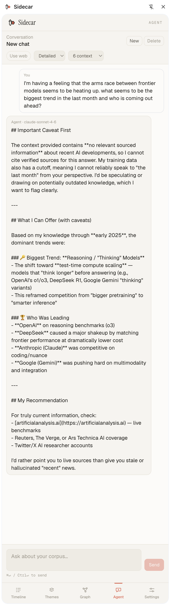

# Sidecar

A Chrome extension that lives in your browser's side panel and acts as a persistent research workspace. As you browse newsletters, Reddit, Twitter, or any web page, you can capture quotes and content, annotate them with personal notes, track their source and date, and search across everything you've saved.

Built as a local-first tool — all data stays in your browser (IndexedDB), with export options for backup and portability.

The extension wears a warm-neutral identity: Instrument Serif for the wordmark and headings, Geist for the body, Geist Mono for the chrome (eyebrows, source tags, keyboard hints). The toolbar icon is a top-down motorcycle outline with a coral sidecar pod — the same mark sits in the panel header next to the wordmark. Day and night modes use the same coral accent over warm-neutral surfaces.

---

## Screenshots

| Timeline | Themes | Agent |
|---|---|---|
|  |  |  |

---

## What it does now

### Capture
- Paste text into the capture bar at the top of the panel to save it instantly
- The current tab's URL and today's date are auto-filled on every capture
- Drag-and-drop or paste images (screenshots) directly into the capture bar — they're stored as attachments on the item
- Add a screenshot to any existing item using the 📎 button on its card
- Press `⌘↵` (or `Ctrl↵`) to capture, `Esc` to clear

### Source tagging
- Every item is automatically tagged with one of six source types: **Newsletter**, **Website**, **Twitter/X**, **Reddit**, **Product**, or **Internal**
  - Pages on `mail.google.com` are tagged Newsletter and attempt to extract the sender name from the open email
  - `twitter.com` / `x.com` pages are tagged Twitter; `reddit.com` pages are tagged Reddit
  - Other public pages are tagged Website by default
  - **Product** and **Internal** are user-assigned — use Product for tool/landing-page captures, Internal for personal notes or company events
- Click the source tag on any item to change it via a dropdown, and edit the sender/label field alongside it

### Timeline
- All captured items appear in reverse-chronological order by default
- Toggle to oldest-first with the sort button at the top of the timeline
- Search across all item content, notes, URLs, and page titles using the search bar (fuzzy search powered by Fuse.js)
- Filter by theme via the chip strip above the list — single-select, intersects with search
- Result count shown when a search or filter is active; clear it to return to the full timeline

### Themes & organization
- Create named, color-coded theme buckets from the Themes tab — 10-color palette, recolorable any time
- Inline rename, color-swatch picker, and delete (cascades — also drops from all tagged items)
- Click the **+ theme** chip on any item to assign an existing theme, or type a new name + `Enter` to create + assign in one step
- Expand any theme on the Themes tab (click its item count) to see all items tagged with it as full cards, newest first
- Each item card shows its assigned theme chips; click the `×` on a chip to unassign

### AI auto-categorize
- One-click **Scan** from the Themes tab sends your corpus to Claude (default: Sonnet 4.6; optional: Haiku 4.5)
- **Scope toggle** below the button — `Untagged (N)` (items with no themes assigned, the default once any exist) or `All (N)` (everything, useful when you want fresh proposals from already-tagged content)
- Cost-confirm popover before sending shows the item count and a rough input-token estimate
- Returns two things in one structured call (Anthropic tool-use): **tag suggestions** to existing themes (with confidence) and **proposals** for new themes (with supporting items)
- Inline **review queue** on the Themes tab — nothing auto-applies:
  - Proposals: editable name + recolorable swatch before approve; approve creates the theme and tags its supporting items in one go
  - Tag suggestions: grouped by theme with per-row ✓/✗ and bulk ✓ all / ✗ all per group
- **Rejection memory** — rejected proposals and assignments are remembered and excluded from the next scan; self-heals if you later manually create/assign the same thing

### Per-item editing
- **URL** — click to edit inline; domain and favicon shown in display mode
- **Date** — click to edit with a date picker; timeline re-sorts automatically when a date is changed
- **Notes** — free-text textarea below each item's content; saves on blur
- **Markdown rendering** — captured content is rendered as formatted markdown (GFM supported)
- **Delete** — remove an item and all its attachments with the ✕ button

### Appearance
- Dark mode, light mode, and system (follows OS setting) — toggled from Settings
- Preference is persisted across sessions

### Backup & restore
- **Connect a backup folder** (File System Access API) — point Sidecar at any folder on disk and it auto-writes a `sidecar-snapshot.json` there on every change (debounced ~2s)
- Point the folder at iCloud Drive / Dropbox / Google Drive and you get free cross-device sync and version history from a service you already trust
- **Restore from folder** loads the snapshot back, replacing local data
- **Import JSON** picks a backup file directly (e.g. one of those auto-snapshots, or any prior export) — shows a summary modal of what's inside before replacing data
- **Export JSON** is a full backup including attachments, settings, suggestions, and rejections (formatVersion 2 — base64-encoded blobs round-trip through import)
- **Export Markdown** — one entry per item, Obsidian-compatible YAML frontmatter
- Storage status line shows whether the browser has marked IndexedDB as persistent (requested automatically on first launch)

### AI research agent
- A Claude-powered chat interface in the **Agent** tab that answers questions grounded in your captured corpus
- **Corpus retrieval** — every prompt runs a ranked Fuse.js search over your items (content, notes, URLs, titles, sender), boosted by theme match, notes match, and recency, and the top hits are fed to the model as context
- **Web augmentation** (optional toggle) — pulls Wikipedia search results + summaries into the context alongside your own items
- **Inline citations** — answers cite sources as `[S#]` (Sidecar item) or `[W#]` (web), and only the sources the model actually used are surfaced under each reply
- **Conversations** persist in IndexedDB — multiple threads, auto-titled from the first prompt, with recent history carried into follow-ups
- Uses prompt caching on every request and adaptive thinking where the model supports it (Opus 4.7 / Sonnet 4.6 — not Haiku); runs against your local Anthropic API key

**Retrieval design note.** Retrieval is currently a single ranked Fuse.js pass over the corpus, with score boosts for theme match, notes match, and recency. **Revisit when** typical corpora exceed ~2000 items or paraphrastic queries start missing items the user knows are there — at that point consider HyDE (a Haiku-written hypothetical-answer expansion fused with the original query) or a true embeddings provider (Voyage, local MiniLM via `transformers.js`, or whatever Anthropic ships), which can slot in beneath the existing context-assembly pipeline.

### Knowledge graph
- An interactive node-link diagram lives in the **Graph** tab. Three node kinds: **items** (neutral), **themes** (their assigned color), and **concepts** (coral accent).
- **Concept extraction** — separate from theme Scan, the **Extract** button (under the Graph tab) runs a Claude tool-use call that pulls named entities — people, products, technologies, papers — out of your captures. Reviewable in a queue, with the same rejection-memory pattern as themes.
- **Derived edges** — for v1, item↔theme and item↔concept links come straight from `themeIds` / `conceptIds`; theme↔theme, concept↔concept, and theme↔concept co-occurrence links are derived in-memory from items that carry both (minimum weight of 2). Nothing is materialized to disk except the existing item-theme rows.
- **Filters & search** — toggle node types on/off, type into the highlight box to fade non-matching nodes. Click any node to see its connections; a Sidebar/detail panel shows the underlying content. Empty graph → empty state with a hint to extract concepts or tag themes.
- **Pop-out** — the side panel is narrow; click **Pop out** to open the graph in a full Chrome tab, with the same canvas plus a richer right-side detail panel. Same IndexedDB, so the panel and the pop-out stay in sync.
- **Agent crossover** — selecting any node and clicking **Ask agent** switches to the Agent tab with the prompt pre-filled to interrogate that item / theme / concept.

### Settings
- Store your Anthropic API key locally (used by scan, concept extract, and the agent)
- Pick the scan model — Sonnet 4.6 (default) or Haiku 4.5 (cheaper, rougher proposals)
- Pick the concept extract model — Sonnet 4.6 (default) or Haiku 4.5
- Pick the agent model — Opus 4.7 (default), Sonnet 4.6, or Haiku 4.5
- Agent defaults — web augmentation on/off, response mode (detailed/concise), and how many corpus items to pull into context (1–12)
- Clear all data from the danger zone

---

## How to use it

A happy-path walkthrough from first install to a fully-connected knowledge graph. Most steps build on the previous one — the order matters.

### 1. First-run setup
1. Build the extension (`npm install && npm run build`) and load `dist/` as an unpacked extension at `chrome://extensions` with **Developer mode** on.
2. Click the Sidecar icon in the toolbar — the side panel opens.
3. Go to the **Settings** tab and paste your Anthropic API key. Pick a scan model, concept-extract model, and agent model (defaults are fine).
4. *Optional but recommended:* click **Connect backup folder** in Settings and point at a synced folder (iCloud / Dropbox / Drive). Auto-snapshots start immediately.

### 2. Capture some items
1. With the side panel open, browse to any newsletter, article, tweet, or page you want to remember.
2. Select text on the page, copy it, then paste into the capture bar at the top of the **Timeline** tab. Hit `⌘↵` (or `Ctrl↵`) to save.
3. The URL, domain, and today's date are auto-filled. Source type is auto-detected (Newsletter / Twitter / Reddit / Website).
4. Add 10–20 items across different topics to make the next steps interesting.

### 3. Organize into themes
1. Go to the **Themes** tab. Either:
   - Create a few themes manually (click **+ new theme**, name it, pick a color), or
   - Click **Scan** at the top of the Themes tab. Claude reads your corpus and proposes both new themes and item-to-theme assignments.
2. In the **Review** queue that appears, approve / reject each proposal and assignment. Rejected items are remembered — they won't come back in the next scan.
3. On the timeline, click **+ theme** on any item to manually assign one too.

### 4. Extract concepts
1. Go to the **Graph** tab. At the top you'll see the **Extract** button.
2. Toggle the scope — **Untagged** (items with no concepts yet) or **All** (re-run over everything). Click **Extract**.
3. The cost-confirm popover shows the item count and rough token estimate. Click **Extract** to send.
4. A **Concept review** queue appears with two sections:
   - **New concepts** — name + supporting items. Click to expand; rename inline before approving.
   - **Tag suggestions** — existing concepts → items, grouped per concept. Per-row ✓/✗ or bulk approve/reject.

### 5. Explore the graph
1. Below the review queue, the graph canvas renders. Items are neutral, themes carry their own color, concepts are coral.
2. Use the type-filter chips (Items / Themes / Concepts) to focus.
3. Type in the **Highlight** box to fade non-matching nodes.
4. Click any node — its connections highlight, and a detail panel opens. From an item node you can open its source; from a theme or concept you see all linked items.
5. For a roomier view, click **Pop out** in the Graph tab header to open the graph in a full Chrome tab.

### 6. Ask the agent about a node
1. With any graph node selected, click **Ask agent** in the detail panel.
2. The view switches to the **Agent** tab and the prompt is pre-filled to interrogate that item / theme / concept.
3. Hit `⌘↵` to send. The answer cites the items it pulled from (`[S#]`), and — if web augmentation is on — any Wikipedia sources (`[W#]`).
4. Follow-up prompts in the same thread keep the conversation context.

### 7. Iterate
1. Capture more items as you browse. Items added since the last scan show up in the **Untagged** scope so re-running Scan / Extract only touches the new stuff.
2. Open the graph periodically — new items wire themselves into the existing structure via their themes and concepts.
3. If a backup folder is connected, every change auto-saves; you can move between machines by pointing a new install at the same folder and clicking **Restore from folder** in Settings.

---

## Coming soon

### User-asserted edges (v2.0)
The graph's structural edges are derived in-memory today — they come straight from item↔theme / item↔concept membership plus co-occurrence over your corpus. v2.0 will add **manual edges**: a "this relates to that" gesture on any two nodes that materializes to the existing `edges` table, persists across sessions, and shows up alongside the derived ones. Useful for asserting connections the model didn't catch (e.g. "this paper is the response to that paper"). The schema is already in place; only the UI and persistence are deferred.

---

## Tech stack

| Concern | Choice |
|---|---|
| Extension | Chrome Manifest V3 + Side Panel API |
| Build | Vite + `@crxjs/vite-plugin` + TypeScript |
| UI | React 18 + Tailwind CSS, Geist + Instrument Serif + Geist Mono via Google Fonts, line-icon set in `components/Icons.tsx` |
| Storage | Dexie.js (IndexedDB) |
| Search | Fuse.js |
| Markdown | react-markdown + remark-gfm |
| AI | Anthropic SDK (claude-opus-4-7 / claude-sonnet-4-6 / claude-haiku-4-5), tool-use for structured output, adaptive thinking + prompt caching for the agent, lazy-loaded |
| Backup | File System Access API (auto-snapshot to user-chosen folder) + persisted IndexedDB |
| Graph | react-force-graph-2d (in-panel canvas + pop-out full-page tab) |
| Export | file-saver |

---

## Development

**Prerequisites:** Node.js, Chrome

```bash
npm install
npm run dev        # starts Vite dev server with hot reload
npm run build      # produces a production build in dist/
```

**Load the extension in Chrome:**
1. Go to `chrome://extensions`
2. Enable **Developer mode**
3. Click **Load unpacked** and select the `dist/` folder
4. Click the Sidecar icon in the toolbar to open the side panel

After reloading the extension, refresh any open tabs to reinitialise the content scripts.

---

## Data & privacy

Everything is stored locally in your browser's IndexedDB. Nothing is sent anywhere unless you enter an Anthropic API key and either run **Scan** (which sends item snippets + notes to the Anthropic API for categorization) or chat with the **Agent** (which sends your prompt plus the retrieved item snippets, and — if web augmentation is on — fetches from Wikipedia). A cost-confirm popover shows the item count and rough token estimate before each scan. The API key itself never leaves your browser.

**Durability.** IndexedDB can be wiped if you clear site data in Chrome. Two protections:
- Sidecar requests **persistent storage** on first launch (survives passive eviction under disk pressure).
- For real durability, **connect a backup folder** — snapshots write to disk on every change. Point at a synced folder (iCloud, Dropbox, Drive) and your data is replicated wherever that service syncs to. The folder handle is the only thing stored on this machine; the files themselves are yours.
